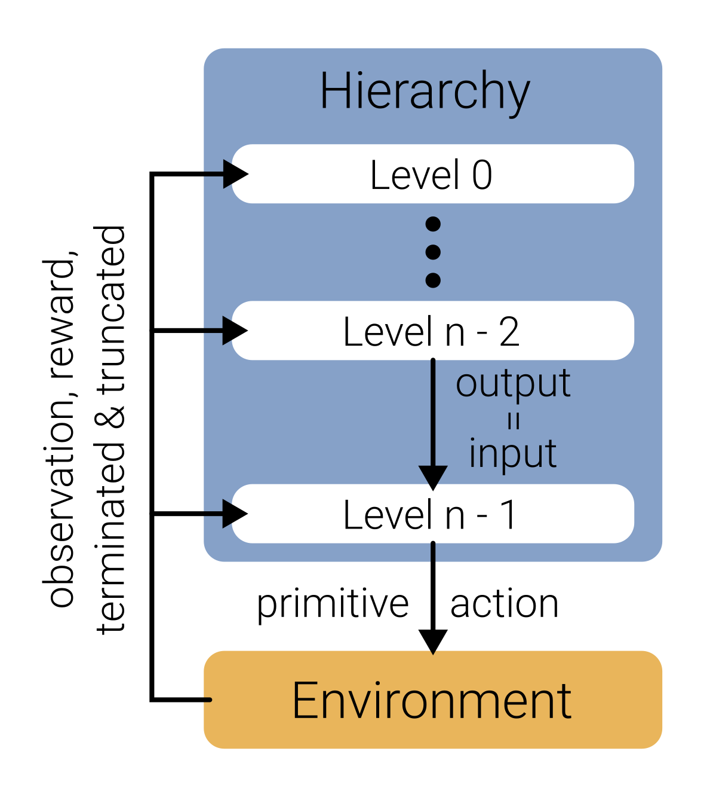

# LayeredRL

<p align="center">
  
</p>


A modular hierarchical RL library that enables composing hierarchies by combining layers or levels. Implemented in Python with PyTorch.

## Overview

LayeredRL aims to accelerate research into hierarchical RL by enabling flexible composition of levels into hierarchies. A level can be a model-free or model-based RL algorithm, a planner using a (learned) model, or a skill-learning algorithm. This modularity allows for fast experimentation. For example, stacking a planner level on top of a skill level results in a non-trivial hierarchical RL algorithm. 

To facilitate setting up new hierarchies, LayeredRL takes care of the 'plumbing' between levels, that is, it makes sure the output of the higher level fits the input of the lower level.

<p align="center">
  
</p>

Note that LayeredRL supports Vector environments. Operations within the hierarchy are vectorized across the environment dimension to provide potential speedups. This applies for model-based and model-free algorithms as well as planners.

| Supported levels    | Type                   |
|---------------------|------------------------|
| TD-MPC2             | Model-based RL         |
| Tianshou            | Model-free RL          |
| DADS                | Skill (TD-MPC2 version)|
| SPlaTES             | Skill                  |
| Planner with (i)CEM | Planner                |

More details on the package can be found in the [documentation](https://layeredrl.readthedocs.io/).

## Features

* Modularity: Levels can be combined into hierarchies
* Ease-of-use through automatic adaptation of input/output dimensions of layers
* Support for vectorized environments (and hierarchies!)
* Tensorboard / WandB logging
* Modified TD-MPC2 version supporting vectorized environments and proper handling of environment termination.

## Installation

We recommend installing LayeredRL into a separate environment. With [uv](https://github.com/astral-sh/uv) creating a new virtual environment and installing LayeredRL looks like this (in the root directory of the repo):

```bash
uv venv
uv pip install .
```

This will write the venv to the path `.venv/`. You can alternatively specify a path like this, `uv venv path-to-venv`.

To create a venv and install the package without uv run (in the root directory of the repository):
```bash
python -m venv path-to-venv
. path-to-venv/bin/activate
pip install .
```

## Getting started

The [documentation](https://layeredrl.readthedocs.io/) and in particular the Quickstart section is a good place to get started. Alternatively, the `examples` directory can provide a first impression of the library. It contains scripts that demonstrate how to set up a hierarchy and how certain components of levels (like the model or planner) work. Assembling and using a hierarchy with LayeredRL follows this pattern:

```python
env = gym.make_vec(...)

level0 = SomeLevelClass(...)
level1 = AnotherLevelClass(...)

hierarchy = Hierarchy(levels=[level0, level1])

hierarchy.train()
collector = Collector(hierarchy=hierarchy, env=env)
collector.reset()
collector.collect(n_steps=..., learn=True)
```

## Citation

If you use LayeredRL, please consider citing it:

```
@software{layeredrl,
	title = {LayeredRL: A Modular Hierarchical Reinforcement Learning Library},
	author = {Gürtler, Nico},
	month = {12},
	url = {https://github.com/nicoguertler/layeredrl},
	version = {0.1.0},
	year = 2025,
}

```