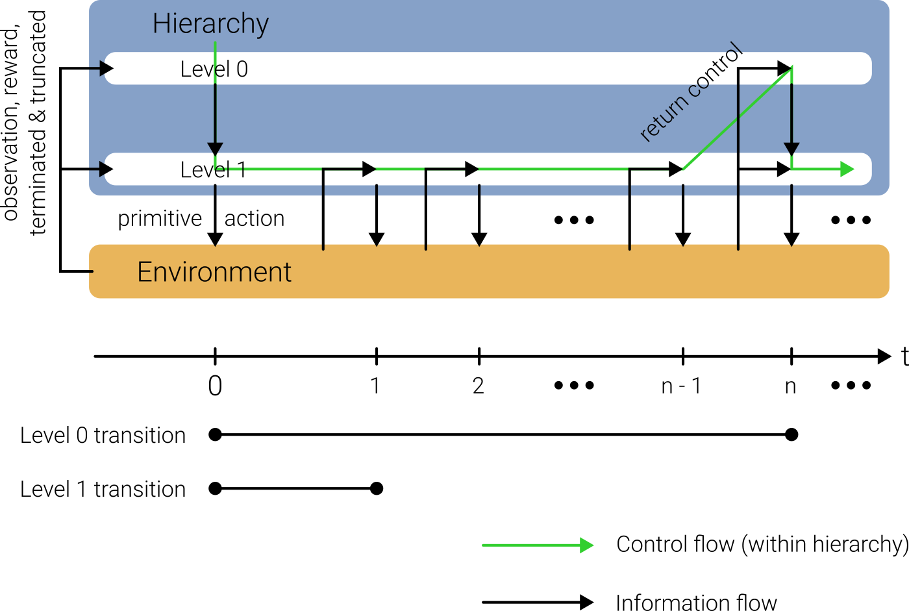

Hierarchies
===========

The ``Hierarchy`` class is the core orchestrator in LayeredRL that manages multiple levels and coordinates their
interactions. It is defined by a list of levels :math:`[\text{level}_0, ..., \text{level}_{n - 1}]` where the highest level comes first and
the lowest last. The output of level :math:`i` is the input of level :math:`i+1` (for example a skill vector or subgoal). 

For simplicity, assume that there is only one environment instance for now. The hierarchy then has to keep track of 
which level is active with an integer :math:`i \in [0,\ldots, n-1]`. Initially, the highest, most
abstract level is active, i.e., :math:`i=0`. When the hierarchy is queried for a primitive action,
a **forward pass** descends the hierarchy starting with the active level :math:`i`. For this level,
:math:`\text{level}_i.`:meth:`~layeredrl.levels.Level.get_action` is executed resulting in some (abstract) action :math:`a_{i}`.
If there is a level below the active one (:math:`i < n - 1`), then :math:`i` is incremented,
:math:`i = i+1`, and the procedure starts again with executing :math:`\text{level}_i.`:meth:`~layeredrl.levels.Level.get_action`, this time with :math:`a_{i-1}` as an input (in addition to the environment observation). :math:`a_{i-1}`
has to be saved until control returns to level :math:`i-1`. This process continues until :math:`i=n-1`, i.e.,
the lowest level of the hierarchy is reached, which produces a primitive action which can be passed to the 
environment.

After a primitive action was passed to the environment and it transitioned to the next time step, a **backward pass**
is executed that starts on the lowest level :math:`i=n-1`. This level now processes the transition, for example by
adding it to a replay buffer. It can then decide whether to return control to the higher level or not, which determines
whether the active level moves up one level or stays the same. When a level decides not to return control or 
the highest level is reached, the backward pass is complete.

The diagram below illustrates control flow in the hierarchy with the example of a two-level hierarchy. The higher
level might pick a subgoal or skill vector initially, which is then pursued by the lower level until some condition
is met, e.g. achievement of the subgoal or a timeout. Then control is returned (in the backward pass) to the higher
level which picks a new abstract action. Hence, the higher a level, the lower the frequency with which it produces
actions. The lowest level has to generate a primitive action for the environment every timestep, however.

Since the backward pass reaches higher levels less frequently, the transitions they observe stretch over longer time
intervals. Formally, they interact with a `Semi-MDP <http://incompleteideas.net/papers/SPS-98.pdf>`_ consisting of the environment and the part of the hierarchy which
lies below the level (see diagram below). The resulting temporal abstraction can facilitate long-term credit assignment.

|

|

In general, there can be several environment instances in a vectorized environment, i.e., all actions and
observations have an additional dimension. Hence, the bookkeeping in the hierarchy operates on vectors as well,
so instead of a single active instance :math:`i`, the hierarchy keeps track of a vector of active instances
:math:`(i_0, \ldots, i_{m-1})` where :math:`m` refers to the number of environment instances.

Creating a Hierarchy
--------------------

Basic Structure
^^^^^^^^^^^^^^^

.. code-block:: python

    from layeredrl.hierarchies import Hierarchy

    hierarchy = Hierarchy(
        levels=[level0, level1, level2],
        env=env,
    )

The levels are ordered from highest (most abstract) to lowest (most concrete).

Observation Maps
^^^^^^^^^^^^^^^^

In some cases, it can make sense to manipulate environment observations before sending them to levels, for example to
hide irrelevant details from higher levels. This can be achieved by specifying environment observation maps
when creating the hierarchy:

.. code-block:: python

    from layeredrl.hierarchies import Hierarchy

    def hide_something(obs):
        return obs[..., 2:]

    hierarchy = Hierarchy(
        levels=[level0, level1],
        env=env,
        env_obs_maps=[hide_something, None],
        mapped_env_obs_shapes=[-2, None],
    )

Setting the map for a level to `None` keeps the environment observation unchanged on this level. A negative entry
in `mapped_env_obs_shapes` indicates that this many dimensions are missing from the mapped environment observation
on this level compared to the full environment observation.

Data Collection and Training
^^^^^^^^^^^^^^^^^^^^^^^^^^^^^^^^^^^

The most convenient way to train a hierarchy is with a :class:`~layeredrl.collectors.Collector` object:

.. code-block:: python

    hierarchy.train()
    collector = Collector(hierarchy=hierarchy, env=env)
    collector.reset()
    stats = collector.collect(n_steps=..., learn=True)

However, it is straightforward to set up a manual training loop:

.. code-block:: python

    hierarchy.train()
    obs, info = env.reset(seed=seed)

    for _ in range(n_vec_steps):
        # Get primitive action from hierarchy
        with torch.no_grad():
            action = hierarchy.get_action(obs)
        action = action.cpu().numpy()

        # Step environment
        obs_next, reward, terminated, truncated, info = env.step(action)

        # Handle resets
        if "_final_observation" in info:
            obs_next_transition = obs_next.copy()
            for i, env_final_obs in enumerate(info["final_observation"]):
                if env_final_obs is not None:
                    obs_next_transition[i] = env_final_obs
        else:
            obs_next_transition = obs_next

        # Process transition
        hierarchy.process_transition(
            obs_next=obs_next_transition,
            rew=reward,
            terminated=terminated,
            truncated=truncated,
        )

        # Learn
        hierarchy.learn()

API Reference
-------------

For detailed API documentation, see :doc:`../api/hierarchies`.
